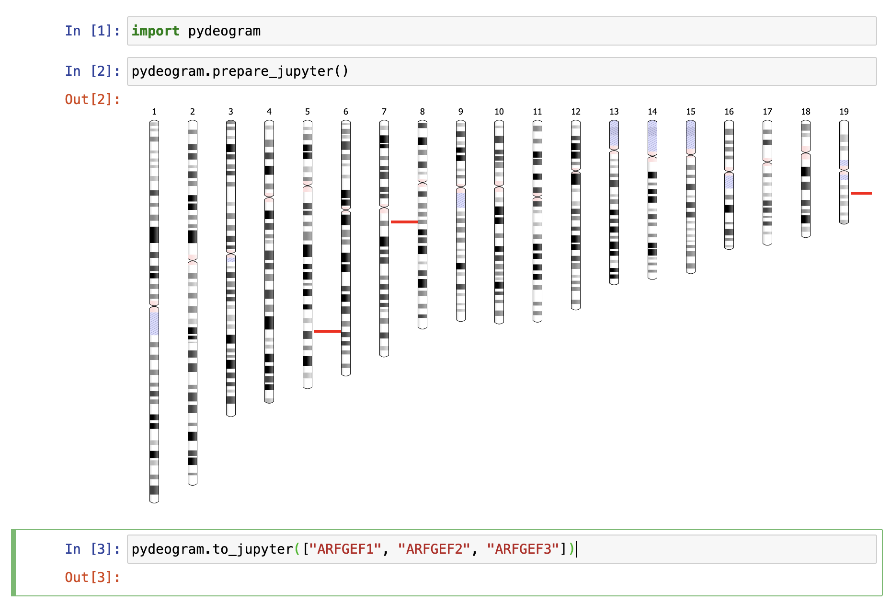

<!--
<p align="center">
  
</p>
-->

<h1 align="center">
  pydeogram
</h1>

<p align="center">
    <a href="https://github.com/cthoyt/pydeogram/actions?query=workflow%3ATests">
        
    </a>
    <a href="https://pypi.org/project/pydeogram">
        
    </a>
    <a href="https://pypi.org/project/pydeogram">
        
    </a>
    <a href="https://github.com/cthoyt/pydeogram/blob/main/LICENSE">
        
    </a>
    <a href='https://pydeogram.readthedocs.io/en/latest/?badge=latest'>
        
    </a>
    <a href="https://codecov.io/gh/cthoyt/pydeogram/branch/main">
        
    </a>  
    <a href="https://github.com/cthoyt/cookiecutter-python-package">
         
    </a>
    <a href='https://github.com/psf/black'>
        
    </a>
    <a href="https://github.com/cthoyt/pydeogram/blob/main/.github/CODE_OF_CONDUCT.md">
        
    </a>
</p>

Generate karyotype pictures using Ideogram.js.

## 💪 Getting Started

`pydeogram` helps you make karyotype plots for your gene lists using
[Ideogram.js](https://github.com/eweitz/ideogram).

```python
import pydeogram

symbols = ["ARFGEF1", "ARFGEF2", "ARFGEF3"]
pydeogram.to_html_path(symbols, path="~/Desktop/argef_ideogram.html")
```


This also works in a Jupyter notebook. Note you need to run the
`prepare_jupyter` and `to_jupyter` functions in succession. I'm looking
for a fix for this so it can be in a single function, but Javascript is 
hard.



The `pydeogram` has a CLI that can do the same thing:

```shell
$ pydeogram write ARFGEF1 ARFGEF2 ARFGEF3 -o ~/Desktop/argef_ideogram.html
```

## 🚀 Installation

The most recent release can be installed from
[PyPI](https://pypi.org/project/pydeogram/) with:

```bash
$ pip install pydeogram
```

The most recent code and data can be installed directly from GitHub with:

```bash
$ pip install git+https://github.com/cthoyt/pydeogram.git
```

## 👐 Contributing

Contributions, whether filing an issue, making a pull request, or forking, are appreciated. See
[CONTRIBUTING.md](https://github.com/cthoyt/pydeogram/blob/master/.github/CONTRIBUTING.md) for more information on getting involved.

## 👋 Attribution

### ⚖️ License

The code in this package is licensed under the MIT License.

### 🍪 Cookiecutter

This package was created with [@audreyfeldroy](https://github.com/audreyfeldroy)'s
[cookiecutter](https://github.com/cookiecutter/cookiecutter) package using [@cthoyt](https://github.com/cthoyt)'s
[cookiecutter-snekpack](https://github.com/cthoyt/cookiecutter-snekpack) template.

## 🛠️ For Developers

<details>
  <summary>See developer instructions</summary>


The final section of the README is for if you want to get involved by making a code contribution.

### Development Installation

To install in development mode, use the following:

```bash
$ git clone git+https://github.com/cthoyt/pydeogram.git
$ cd pydeogram
$ pip install -e .
```

### 🥼 Testing

After cloning the repository and installing `tox` with `pip install tox`, the unit tests in the `tests/` folder can be
run reproducibly with:

```shell
$ tox
```

Additionally, these tests are automatically re-run with each commit in a [GitHub Action](https://github.com/cthoyt/pydeogram/actions?query=workflow%3ATests).

### 📖 Building the Documentation

The documentation can be built locally using the following:

```shell
$ git clone git+https://github.com/cthoyt/pydeogram.git
$ cd pydeogram
$ tox -e docs
$ open docs/build/html/index.html
``` 

The documentation automatically installs the package as well as the `docs`
extra specified in the [`setup.cfg`](setup.cfg). `sphinx` plugins
like `texext` can be added there. Additionally, they need to be added to the
`extensions` list in [`docs/source/conf.py`](docs/source/conf.py).

### 📦 Making a Release

After installing the package in development mode and installing
`tox` with `pip install tox`, the commands for making a new release are contained within the `finish` environment
in `tox.ini`. Run the following from the shell:

```shell
$ tox -e finish
```

This script does the following:

1. Uses [Bump2Version](https://github.com/c4urself/bump2version) to switch the version number in the `setup.cfg`,
   `src/pydeogram/version.py`, and [`docs/source/conf.py`](docs/source/conf.py) to not have the `-dev` suffix
2. Packages the code in both a tar archive and a wheel using [`build`](https://github.com/pypa/build)
3. Uploads to PyPI using [`twine`](https://github.com/pypa/twine). Be sure to have a `.pypirc` file configured to avoid the need for manual input at this
   step
4. Push to GitHub. You'll need to make a release going with the commit where the version was bumped.
5. Bump the version to the next patch. If you made big changes and want to bump the version by minor, you can
   use `tox -e bumpversion minor` after.
</details>
